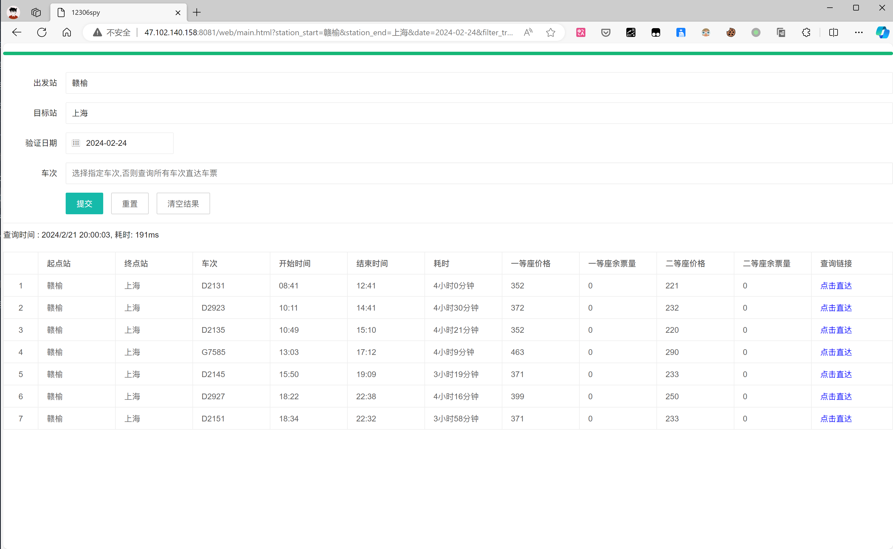
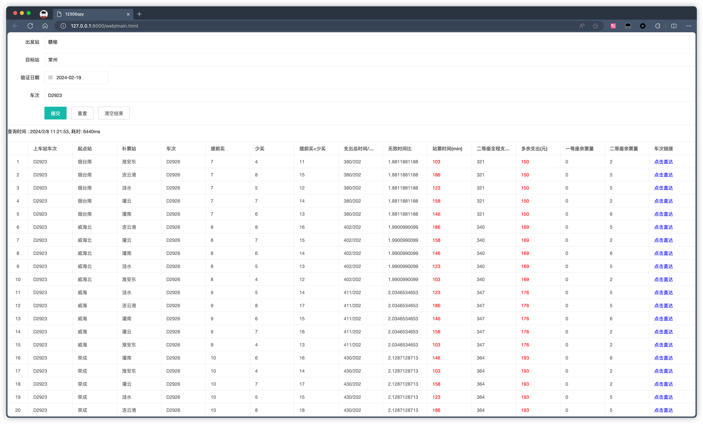

# 12306spy

## 背景
从12306购票, 从A点到B点没有票, 但是可以补票或者多买一段票. 

比如一列车有100站, 我上车的站点是50 , 终点站是80. 需要保证我能上车,可以这样操作 : 
1. 补票类型 : 可以买 50-70的票, 然后再补70-80的票
2. 多买一段票 : 买20-80的票, 或者20-90, 这样多买了一段票, 但是保证了我能上车.
3. 多买且补票 : 买20-70的票, 然后再补70-80的票

##   如何使用
> 输入`开始`和`结束`站点,以及`日期`,查询`所有车次`
> 
> 点击右侧的`点击直达` , 则开始在这里车次中`可以上车的票`

## Docker 
`docker run -d -p 8081:8080 registry.cn-hangzhou.aliyuncs.com/elroy93/12306spy:latest`

## windows源码启动
点击`install.bat`安装依赖, 打开`http://127.0.0.1:8081/web/main.html`即可使用`  
- 出发站
- 目标站
- 日期
- 车次
> 红色的部分是需要着重关注的地方。
> 
> `提前买`: 在起点站前多买N站之前的票
> 
> `少买` : 少买N站的票,需要补票

## ide推荐
- pycharm
- vscode + jupyter插件
